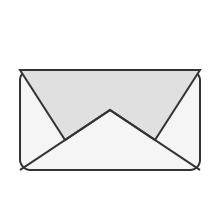

# welcomer



Sends configurable welcome emails to guests loaded from iCal calendar URLs. Built for accommodation
businesses — reads reservations from a calendar and emails each guest a personalised welcome
message.

## Install

```sh
pip install welcomer
# or with uv (recommended)
uv tool install welcomer
# or with pipx
pipx install welcomer
```

## Container

```sh
podman run --rm \
  -v ~/.config/welcomer:/root/.config/welcomer:ro \
  ghcr.io/pdostal/welcomer --dry-run
```

`latest` is updated on every push to `master`. Tagged releases follow `vX.Y.Z`.

## Setup

```sh
brew install uv taplo
uv sync
# copy the example config below to config.toml and edit it
```

## Usage

```sh
uv run welcomer --dry-run              # preview recipients list
uv run welcomer --dry-run --print-note # also show rendered message per guest
uv run welcomer                        # interactive send (default)
uv run welcomer --yes                  # send to all without prompting
uv run welcomer --yes --silent         # send silently (suppress info messages)
uv run welcomer --dry-run --test-config  # test with bundled sample calendars
```

## Config

Config is loaded from the first path that exists:

1. `config.toml` in the current directory
1. `~/.config/welcomer/config.toml`

Example config:

```toml
subject = "Reservation confirmed – {{ name }}"

# Only show reservations starting within this many days from today (optional)
# days = 30

# Days before check-in when a reservation becomes eligible to send (default: 14)
# advance = 14

# Send to CC/BCC even when the guest email is unknown (default: false)
# send_without_email = false

body = """
Dear {{ name }},

Thank you for your reservation from {{ start }} to {{ end }} at {{ official_name }}.
We look forward to hosting you ({{ adults }} adults, {{ kids }} kids).

If you have any questions, reply to this email.
"""

[smtp]
host = "smtp.example.com"
port = 587
from = "info@myproperty.com"
from_name = "My Property"          # optional: sets the From display name
# cc = ["manager@myproperty.com"] # optional: CC every outgoing email
# bcc = ["audit@myproperty.com"]  # optional: BCC (not shown in headers)
username = "info@myproperty.com"
password = "secret"
tls = true      # use STARTTLS (port 587)
# ssl = true    # use SSL/TLS instead (port 465)

[[calendars]]
property = "My Property"
official_name = "My Property s.r.o."  # optional: legal/official name for templates
provider = "BookingProvider"
url = "https://example.com/calendar.ics"
```

**Backward compatibility:** the `name` key in `[[calendars]]` is still accepted and maps to
`property`. Existing configs do not need to be updated.

### Template variables

Templates use [Jinja2](https://jinja.palletsprojects.com/) syntax: `{{ variable }}`,
`...`, filters (`| upper`, `| default('fallback', true)`).

| Variable | Description | Empty when | | -------------- |
-------------------------------------------- | -------------------------- | | `name` | Guest name |
— | | `email` | Guest email address | no email on reservation | | `phone` | Guest phone number | no
phone on reservation | | `start` | Check-in date (formatted per `date_format`) | — | | `end` |
Check-out date (formatted per `date_format`) | — | | `adults` | Number of adult guests | not
provided by calendar | | `kids` | Number of child guests | not provided by calendar | | `property` |
Property name (from `[[calendars]]`) | not configured | | `official_name` | Legal/official property
name | falls back to `property` | | `provider` | Booking provider name | not configured | |
`summary` | Raw iCal event summary | — |

**Jinja2 examples:**

```jinja
{# Conditional block #}
We can be reached at {{ phone }}.

{# Fallback value #}
{{ phone | default('contact us by email', true) }}

{# Inline conditional #}
{{ phone if phone else 'reply to this email' }}

{# Both adults and kids with nested condition #}
{{ adults }} adults, {{ kids }} kids

{# Upper-case filter #}
{{ name | upper }}
```

## Local SMTP testing with Mailpit

**[Mailpit](https://mailpit.axllent.org/)** catches outgoing emails locally without actually
delivering them. It gives you a web inbox at `http://localhost:8025` and listens for SMTP on port
1025 — no account, no real delivery, no risk of accidentally mailing guests.

```sh
brew install mailpit
mailpit                  # starts in the foreground; Ctrl-C to stop
```

Mailpit also runs as a macOS service if you prefer:

```sh
brew services start mailpit
```

Add this to your config while testing:

```toml
[smtp]
host = "localhost"
port = 1025
from = "test@localhost"
# no username / password / tls needed for Mailpit
```

Then run welcomer as normal — all emails land in the Mailpit inbox at `http://localhost:8025`
instead of being delivered.

## Interactive mode

Interactive mode is on by default. The app prompts before sending each eligible email (check-in
within the `advance` window, default 14 days). Use `--yes` to skip prompts. Previously sent
reservations are tracked in `~/.config/welcomer/sent.log` and skipped automatically on future runs.

The `Sent` column shows the status of each reservation:

| Symbol | Colour | Meaning | | ------ | ------ | ------- | | `✓` | green | Already sent (in
sent.log) | | `●` | green | Eligible to send now (check-in within advance window) | | `○` | yellow |
Not yet eligible (check-in too far away) | | (empty) | — | No email address (unless
`send_without_email = true`), or check-in already passed and not yet sent |

When `send_without_email = true`, reservations without a guest email still show `○`/`●` and will be
sent to CC/BCC recipients only. Requires CC or BCC to be configured in `[smtp]`.

## Calendar cache

Remote iCal URLs are cached for **5 hours** in `~/.config/welcomer/cache/`. This avoids hitting your
calendar provider on every run. Use `--force-refresh` to bypass the cache and re-fetch all remote
URLs immediately:

```sh
uv run welcomer --dry-run --force-refresh
```

The cache directory is created automatically. Each URL is stored as a separate `<sha256-of-url>.ics`
file. Local file paths and `--test-config` are never cached.

## Multi-property reservations

When the same guest (identical name, provider, check-in, and check-out) appears across multiple
properties, welcomer merges them into a single **Multi** entry and sends one email. The property
column shows `Multi` and overlapping reservations from other providers are still detected correctly.

## Overlap detection

welcomer warns when two reservations for the same property have overlapping dates. Warnings appear
above the table regardless of the `--days` filter. Affected rows are highlighted in red.

## Recipient extraction

Recipients are extracted from calendar events in this order:

1. `ATTENDEE` entries
1. `ORGANIZER` if no attendees
1. `SUMMARY` (name) + `Description` field (email via `Email:`, phone via `Telefon:`) as last resort

Phone and email parsed from `Description` are available in all three cases.
